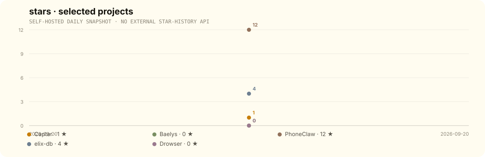

<div align="center">

# Devansh Mahant

<a href="https://devansh.aurat.ai">
  
</a>

**Senior SWE @ Stride.AI** · AI engineering · agents · full-stack  
**ICPC Regionalist · Top 0.3% LeetCode**

[Portfolio](https://devansh.aurat.ai) · [LinkedIn](https://linkedin.com/in/devansh-m12) · [Email](mailto:devansh21y@gmail.com)

</div>

<br />

<a href="https://devansh.aurat.ai">
  
</a>

<sub>The scene above is generated from the actual `8dazo/portfolio` street SVG + walk-cycle CSS and stays synced automatically.</sub>

<br />

## about me · under the hood

I move between **agent infrastructure, full-stack products, model systems, and lower-level engineering**. The medium changes; the habit stays the same: understand the constraint, build the smallest useful system, then measure what happens in the real world.

```text
agent infrastructure  → tools · guardrails · evals · traces
full-stack products   → next.js · node · postgres
model systems         → LoRA · RAG · vision
systems engineering   → rust · go · elixir
```

> beautiful systems that actually ship.

## selected projects · worth a look

### 01 — [Captar](https://captar.aurat.ai) · [repo](https://github.com/8dazo/captor)
**Runtime control for LLM applications**  
A guardrail layer that wraps the OpenAI client — per-session budget reservations, tool allowlists, and execution policy. No proxy; keys stay inside the host app. Span-first tracing with violation capture and eval-ready dataset export.

`TypeScript` `Next.js` `PostgreSQL` `OpenAI API`

### 02 — [Baelys](https://baelys.aurat.ai) · [repo](https://github.com/8dazo/baelys-app)
**Multi-model AI image editor**  
20+ LoRA style-transfer models, AI background removal, and a canvas-based multi-layer editor. Launched on Product Hunt and monetized with tiered subscriptions.

`Next.js` `Node.js` `LoRA` `Canvas`

### 03 — [PhoneClaw](https://github.com/8dazo/phoneclaw)
**Phone automation, fully local**  
End-to-end Android automation inspired by OpenClaw — an agent that drives your phone while running entirely on-device. No cloud, no leaks.

`TypeScript` `Android` `Agents`

### 04 — [elix-db](https://github.com/8dazo/elix-db)
**A vector database from scratch**  
Custom vector DB built in Elixir to explore indexing architectures such as HNSW and IVFFlat from first principles.

`Elixir` `HNSW` `IVFFlat`

### 05 — [Drowser](https://github.com/8dazo/drowser)
**A browser that lives in your terminal**  
Terminal-based browser engineered in Go, driving Brave in headless mode. The web, rendered where developers actually live.

`Go` `Headless` `CLI`

## what I work with

`LLM Orchestration` · `Agents` · `RAG` · `LoRA Fine-Tuning` · `TypeScript` · `Python` · `Rust` · `C++` · `Next.js` · `Node.js` · `PostgreSQL` · `Docker` · `AWS` · `Solidity` · `Eval Pipelines`

## commits · but make them move

<picture>
  <source media="(prefers-color-scheme: dark)" srcset="./assets/github-snake-dark.svg" />
  <source media="(prefers-color-scheme: light)" srcset="./assets/github-snake.svg" />
  
</picture>

## stars · selected projects



<sub>Tracked daily inside this repo so the chart keeps working even after GitHub's 2026 stargazer-history API restrictions.</sub>

## github · activity

<div align="center">
  
  
</div>

<br />


<br />

<div align="center">

### let's build something weird

[devansh.aurat.ai](https://devansh.aurat.ai) · [devansh21y@gmail.com](mailto:devansh21y@gmail.com)

<sub>ship it ✦ break it ✦ fix it ✦ ship it again</sub>

</div>
